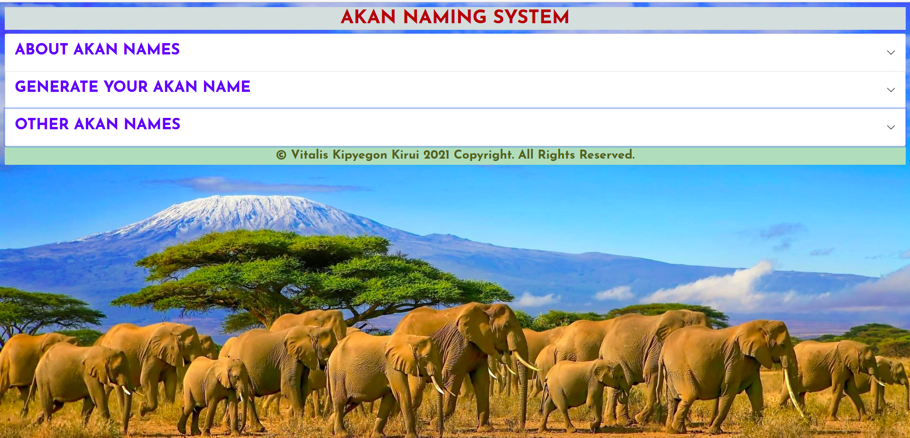
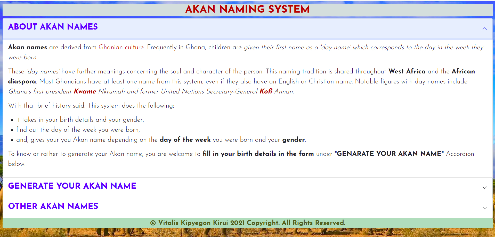
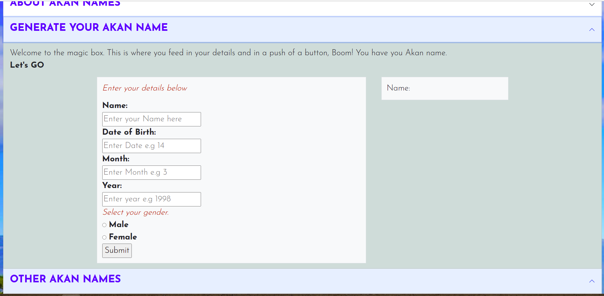
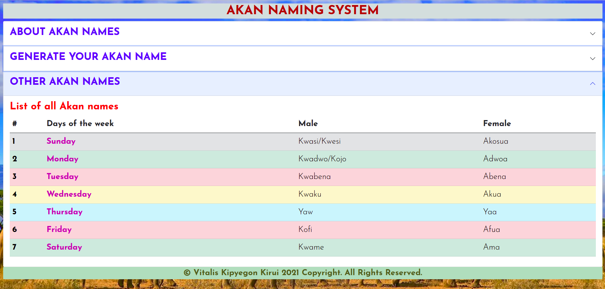

# AKAN NAMING SYSTEM.
This project is on Akan names. It's a system that generate Akan names using user filled in data.
## Author
Kipyegon Kirui Vitalis.
# Description
When you are in the site, first you will see is the first item of the accordion which automatically opens. It has a brief history of Akan names.
The project employs use accordions. It has various section including About Names as the landing page. It has a section for the fomr where one enters their details and gets their akan names generate. There is a last section where is has all the akan names in form of a table. Last but not least is the footer.
# Active link
This is the link to the project repository on github https://github.com/Vitalis-Kirui/Akan-names-system
## Screenshots of our website
General look.

&nbsp;

This is the look of of the entire system  when all accordions are closed.

Accordion Item #1.

&nbsp;

This is the section with brief history of Akan names.

&nbsp;

Accordion #2.

&nbsp;

This is the section with the form for user to enter their details.

&nbsp;

Accordion #3.

&nbsp;

This section has a table for all Akan names.

## Setup/Installation Requirements
Git-incase you want to clone it.
browser- to access git and deployment
Internet
A pc
Text Editor- once you have clone.
## Known bugs
There are no known bugs at the moment. If you experience any, please reach out.
## Technologies used
* HTML
* CSS
* Javascript
* Bootstrap
## Contact details
You can reach to me here for any assistance: Email:vitaliskirui1@gmail.com, Phone Number: 0714856555.